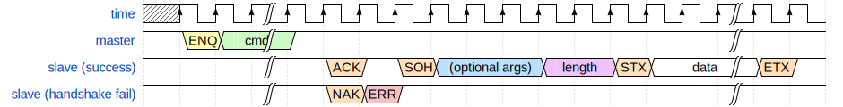
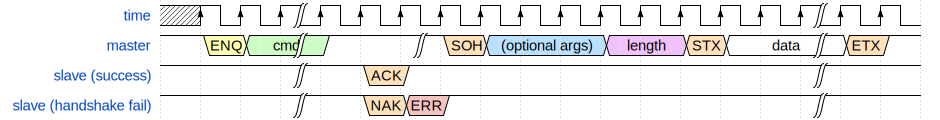
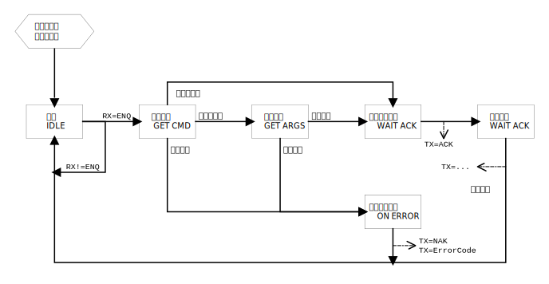

# 上位机程序设计和协议

*注：位于Oil/AutoPerforation/Submodules/HostCommunication-x86>中doc目录下的文档是最新的版本。*

### 一、程序组成

上位机程序使用Python开发，分三个模块。

- 功能模块：具体的通信等功能的函数
- 命令行模块：通过命令行控制业务模块的程序
- 图形界面模块：与命令行功能相同，但是变成图形界面

### 二、包含功能

1. 复位
    硬件置位RTS
2. 控制
    包括采样开始、采样停止等
3. 显示客户机传回的内容
4. 导出数据
    包括导出某页、导出整个Flash等
5. 擦除闪存
    包括块擦除和全片擦除
6. 导入配置信息
    写入Flash
7. 待定

*相较于文档，目前代码功能有所增加，待更新。*

### 三、串口通信协议

上位机和单片机（从机）程序中各有一个平台无关的软件状态机，由串口接收到的字节驱动转移。

状态机中有两个状态量，一个记录握手协议的状态（简称状态），一个记录当前的功能模式（简称模式）。模式的引入是为了检查发送的指令是否符合当前的状态，防止传入错误指令。详见下文。

注：方框中的符号为ASCII控制符，详情见相关文档^[1]^。

#### 1. 各常数定义

暂时未整理在这里，请参阅代码仓库`BUSINESS\HostCommunication\`目录下的`HostCommunication.h`、`HostCommunicationCommandCode.h`、`HostCommunicationErrorCode.h`。

#### 2. 从机状态机复位

从机状态机在任何状态，上位机连续发送8次`␘(0x18)`，从机状态机即复位到就绪状态。

串口最后一个字节接收到后一段时间（例如1秒）内没有新的字节送入，即视为传输结束，从状态机复位。如果在等待数据传输，则认为传输错误。并且发送状态机复位码使从机状态机复位。

#### 3. 从机发送文本

~~从机发送`␂(0x02)`，上位机进入接收文本状态，直到接收到`␃(0x03)`为止，中间的所有字节全部视为文本。~~

就绪状态，默认把输出都作为文本。

#### 4. 上位机发送命令、从机返回数据的典型过程

上位机发送`␅(0x05)`，从机收到后进入命令识别模式，根据命令格式识别完成后发送有效标志`␆(0x06)`或无效标志`␕(0x15)`。回复`␕`时下一个比特发送错误代码，回复`␆`不需要发送。参考图中“slave (handshake fail)”。

如果要回复二进制数据，则在回复`␆`后先发`␁(0x01)`，之后按照相应命令的规定发送参数，例如2字节`uint16`表示从机将要发送的字节数量减一（不包括控制符）；然后发送`␂(0x02)`；再发送要发送的所有字节；最后以`␃(0x03)`结尾，以验证是否错位。如果上位机接收到的控制位与约定不符，则认为从机发回的数据有错误。参考图中“slave (success)”。

`uint16`最多表示65536个字节需要传输。是否支持更长的字节数有待考虑。

若无说明，则默认小端顺序传输。

##### 参考时序：

##### 注意：

1. 上位机发送`␅`后，在从机回复`␆`或`␕`前，应当谨慎考虑发送下一个`␅`

   目前的实现：

   - 命令暂存在缓冲中，待执行完成后再读取新的指令
   - 如果上一次命令未执行完成，则这个时候发送`␅`会回复`␕`+`0x11`（`HC_ErrCode_Busy`），完成握手并报错，但是什么也不执行

2. 改用`字节数量减一`字段而不是`字节数量`字段，是因为65536无法用2个字节表示。这意味着发送100个字节的数据，传输的`字节数量减一`字段为99；发送1个字节则`字节数量减一`为0（类似于AMBA总线的思路）

#### 5. 上位机发送命令、从机接收数据并相应的典型过程

上位机发送`␅(0x05)`，从机收到后进入命令识别模式，根据命令格式识别完成后发送有效标志`␆(0x06)`或无效标志`␕(0x15)`。回复`␕`时下一个比特发送错误代码，回复`␆`不需要发送。参考图中“slave (handshake fail)”。

如果从机要接受二进制数据，则回复`␆`。上位机收到`␆`后先发`␁(0x01)`，之后按照相应命令的规定发送参数，例如2字节`uint16`表示从机将要发送的字节数量减一（不包括控制符）；然后发送`␂(0x02)`；再发送要发送的所有字节；最后以`␃(0x03)`结尾，以便从机验证是否错位。参考图中“slave (success)”。

`uint16`最多表示65536个字节需要传输。是否支持更长的字节数有待考虑。

若无说明，则默认小端顺序传输。

##### 注意：

1. 上位机发送`␅`后，在从机回复`␆`或`␕`前，应当谨慎考虑发送下一个`␅`

    目前的实现：

    - 命令暂存在缓冲中，待执行完成后再读取新的指令
    - 数据暂存在缓冲中，若不及时读走可能会丢数据
    - 如果上一次命令未执行完成，则这个时候发送`␅`会回复`␕`+`0x11`（`HC_ErrCode_Busy`），完成握手并报错，但是什么也不执行

2. 改用`字节数量减一`字段而不是`字节数量`字段，是因为65536无法用2个字节表示。这意味着发送100个字节的数据，传输的`字节数量减一`字段为99；发送1个字节则`字节数量减一`为0（类似于AMBA总线的思路）

3. 本协议从机不会回复，必须要主机主动询问是否有错，为此对于特定命令，从机需要配套增加对应的命令回复（类似“上位机发送命令、从机返回数据”）

##### 参考时序：

#### 6. 忙判定的技巧

发送`␅`+`0x01`（`NOP`），若回复`␆`则空闲，若回复`␕`+`0x11`则忙。

#### 7. 采样开始停止控制

开始采样：cmd=`0x10`

停止采样：cmd=`0x11`

无参数

开始采样后，会进入采样模式，在停止采样前不能切换到其他模式。

#### 8. Flash擦除

先发送`␅`+`0x20`进入储存器操作模式，无参数，从机返回状态标志。

切换块方法见上文。

擦除一个块：发送`␅`+`0x23`，从机返回状态标志。

全片擦除：发送`␅`+`0x2F`，从机返回状态标志。

#### 9. 导出Flash数据

先发送`␅`+`0x20`进入储存器操作模式，无参数，从机返回状态标志。

切换块（64KB）：默认块号是0，发送`␅`+`0x21`、块号（2B），从机返回状态标志。

输出一个块：发送`␅`+`0x22`，从机返回状态标志、`␁`、数据长度减一（2B）、`␂`、数据（典型64KB）、`␃`。

发送`␅`+`␛ (0x1B)`退出导出数据模式，从机返回状态标志。

注意：储存器操作模式的指令要先发送`␅`+`0x20`进入储存器操作模式后才能执行，否则会回复`␕`+`0xa2`（`HC_ErrCode_ModeError`）

#### 10. 向Flash写入数据

先发送`␅`+`0x20`进入储存器操作模式，无参数，从机返回状态标志。

查询Flash是否忙：发送`␅`+`0x29`，从机返回状态标志、`␂`、状态代码（`0x00`空闲、`0x11`忙）、`␃`。

发送写指令：发送`␅`+`0x2a`、地址（4B）、数据长度减一（2B），等待从机返回状态标志，若返回`␕`则停止；若返回`␆`，则发送`␂`、数据（典型4KB）、`␃`。

查询写入是否成功：发送`␅`+`0x28`，从机返回状态标志、`␂`、状态代码（`0x00`成功、`0x13`协议错误、……）、`␃`。

发送`␅`+`␛ (0x1B)`退出导出数据模式，从机返回状态标志。

注意：储存器操作模式的指令要先发送`␅`+`0x20`进入储存器操作模式后才能执行，否则会回复`␕`+`0xa2`（`HC_ErrCode_ModeError`）

注意：由于缓存有限，最大数据长度暂定为缓存大小4KB

### 四、从机的通信握手状态机

*本图是从机为实现通信协议的状态机。主机如何实现通信协议与本图无关。*

### 参考文档

1. [控制字符](https://zh.wikipedia.org/wiki/ASCII#%E6%8E%A7%E5%88%B6%E5%AD%97%E7%AC%A6)；
