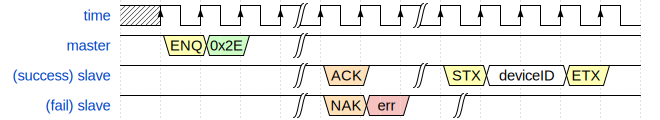

# 上位机程序设计和协议

*注：位于Oil/AutoPerforation/Submodules/HostCommunication-x86>中doc目录下的文档是最新的版本。*

### 一、程序组成

上位机通信程序分为主机和从机两部分。其中：

- 主机：Python编写，位于Oil/AutoPerforation/Oil_AutoPerforation_Host2>
- 从机：C编写，原型位于Oil/AutoPerforation/Submodules/HostCommunication-x86>，部署于Oil/AutoPerforation/STM32H7_SignalCollectionPlus>

### 二、串口通信协议

上位机（主机）和单片机（从机）程序中各有一个平台无关的软件状态机，由串口接收到的字节驱动转移。

状态机中有两个状态量，一个记录握手协议的状态（简称状态），一个记录当前的功能模式（简称模式）。模式的引入是为了检查发送的指令是否符合当前的状态，防止传入错误指令。详见下文。

注：方框中的符号为ASCII控制符，详情见相关文档[^1]。

#### ㈠ 各常数定义

暂时未整理在这里，请参阅代码仓库目录下的[`HostCommunication.h`](../HostCommunication.h)、[`HostCommunicationCommandCode.h`](../HostCommunicationCommandCode.h)、[`HostCommunicationErrorCode.h`](../HostCommunicationErrorCode.h)。

#### ㈡ 典型时序模型

所有的指令都遵从共同的时序规定：

1. 指令以`␅(0x05)`开头，指令代码1个字节。指令有效时，从机回复`␆`；否则，从机回复`␕`以及1个字节的错误码；
2. 无论是主机还是从机，数据块参数（可选）以`␁(0x01)`开头，数据块内容以`␂(0x02)`开头，`␃(0x03)`结尾；
   这三个控制符是为了验证字节流有无错位；如果主机接收到的控制位字符与约定不符，则认为从机发回的数据有错误；
3. 若无说明，则默认小端顺序传输超过1字节的数据。

所有的指令时序可以按照如下方法分类：

1. 按照参数可分为
   - 无参数
   - 有参数
2. 按照是否有数据块可分为
   - 无数据块
   - 主机发送数据块
   - 从机发送数据块
3. 按照数据块长度可分为
   - 定长数据块（包括无数据块）
   - 变长数据块

下面对部分典型时序进行举例，其余时序可以根据相同的原则推导得出：

##### 1. 无参数，无数据块

##### 2. 定长参数，主机发送无参数数据块

##### 3. 无参数，从机发送带参数数据块（变长）

#### ㈢ 指令及其时序

##### 1. 空指令

| 命令字   | HC_CMD_NOP（`0x01`） |
| -------- | -------------------- |
| 命令参数 | 无                   |
| 数据块   | 无                   |

**技巧：**

可以使用本指令判定从机的上位机通信模块是否正忙。若回复`␆`则空闲，若回复`␕`+`0x11`则忙。

##### 2. 无效指令

| 命令字   | HC_CMD_INVALID0（`0x00`） HC_CMD_INVALID1（`0xFF`） |
| -------- | -------------------------------------------------------- |
| 命令参数 | 无                                                       |
| 数据块   | 无                                                       |

**注意：**

该命令永远返回错误。

##### 3. 功能状态回到就绪

##### 4. 开始采样、停止采样

##### 5. 操作Flash模式

##### 6. 指定64K块编号、指定4K扇区编号

##### 7. 导出当前64K块

| 命令字     | HC_CMD_Output64kBlock（`0x22`）  |
| ---------- | -------------------------------- |
| 命令参数   | 无                               |
| 数据块     | 从机发送                         |
| 数据块参数 | `uint16`：数据块`data`的长度减一 |
| 数据块内容 | 闪存64K块的内容                  |

**说明：**

本指令最大允许传输长度为65536，即`uint16`所能表示的索引范围；使用`字节数量减一`字段而不是`字节数量`字段，是因为65536无法用2个字节表示。这意味着发送100个字节的数据，传输的`字节数量减一`字段为99；发送1个字节则`字节数量减一`为0（类似于AMBA总线的思路）

##### 8. 擦除当前64K块、擦除当前4K扇区

##### 9. 询问闪存上次写入是否出错

状态代码（`0x00`成功、`0x13`协议错误、……）

##### 10. 询问闪存是否忙

##### 11. 在闪存指定地址写入数据

| 命令字     | HC_CMD_WriteFlashAtAddr（`0x2A`）                            |
| ---------- | ------------------------------------------------------------ |
| 命令参数   | `uint32`：闪存中的目标地址 `uint16`：数据块`data`的长度减一 |
| 数据块     | 主机发送                                                     |
| 数据块参数 | 无                                                           |
| 数据块内容 | 闪存64K块的内容                                              |

**注意：**

本指令从机不会回复写入是否成功，必须由主机再次主动询问。

##### 12. 询问Flash型号ID

| 命令字     | HC_CMD_AskFlashDeviceID（`0x2E`） |
| ---------- | --------------------------------- |
| 命令参数   | 无                                |
| 数据块     | 从机发送                          |
| 数据块参数 | 无                                |
| 数据块内容 | `uint16`：当前闪存颗粒的器件型号  |

注意：目前程序内的时序与本规定不符，有待修改

##### 13. 全片擦除

##### 14. 设置RTC时间

#### ㈢ 功能的实现

##### 1. 从机状态机复位

从机状态机在任何状态，上位机连续发送8次`␘(0x18)`，从机状态机即复位到就绪状态。

串口最后一个字节接收到后一段时间（例如1秒）内没有新的字节送入，即视为传输结束，从状态机复位。如果在等待数据传输，则认为传输错误。并且发送状态机复位码使从机状态机复位。

##### 2. 从机发送文本

就绪状态，默认把从机输出都作为文本。

##### 10. 向闪存写入数据

1. 进入闪存操作模式
2. 询问闪存是否忙
3. 在闪存指定地址写入数据
4. 询问闪存上次写入是否出错
5. 退出闪存操作模式

注意：

1. 储存器操作模式的指令要先发送`␅`+`0x20`进入储存器操作模式后才能执行，否则会回复`␕`+`0xa2`（`HC_ErrCode_ModeError`）
2. 由于缓存有限，最大数据长度暂定为缓存大小4KB

#### ㈣ 注意事项

1. 上位机发送`␅`后，在从机回复`␆`或`␕`前，应当谨慎考虑发送下一个`␅`；
2. 目前的实现存在以下特点
   - 命令暂存在缓冲中，待执行完成后再读取新的指令；
   - 数据暂存在缓冲中，若不及时读走可能会丢数据；
   - 如果上一次命令未执行完成，则这个时候发送`␅`会回复`␕`+`0x11`（`HC_ErrCode_Busy`），完成握手并报错，但是什么也不执行；

------

两条横线之间的内容应当删除。

#### 7. 采样开始停止控制

开始采样：cmd=`0x10`

停止采样：cmd=`0x11`

无参数

开始采样后，会进入采样模式，在停止采样前不能切换到其他模式。

#### 8. Flash擦除

先发送`␅`+`0x20`进入储存器操作模式，无参数，从机返回状态标志。

切换块方法见上文。

擦除一个块：发送`␅`+`0x23`，从机返回状态标志。

全片擦除：发送`␅`+`0x2F`，从机返回状态标志。

#### 9. 导出Flash数据

先发送`␅`+`0x20`进入储存器操作模式，无参数，从机返回状态标志。

切换块（64KB）：默认块号是0，发送`␅`+`0x21`、块号（2B），从机返回状态标志。

输出一个块：发送`␅`+`0x22`，从机返回状态标志、`␁`、数据长度减一（2B）、`␂`、数据（典型64KB）、`␃`。

发送`␅`+`␛ (0x1B)`退出导出数据模式，从机返回状态标志。

注意：储存器操作模式的指令要先发送`␅`+`0x20`进入储存器操作模式后才能执行，否则会回复`␕`+`0xa2`（`HC_ErrCode_ModeError`）

------

### 四、从机的通信握手状态机

*本图是从机为实现通信协议的状态机。主机如何实现通信协议与本图无关。*

### 参考文档

[^1]: [控制字符](https://zh.wikipedia.org/wiki/ASCII#%E6%8E%A7%E5%88%B6%E5%AD%97%E7%AC%A6)；
